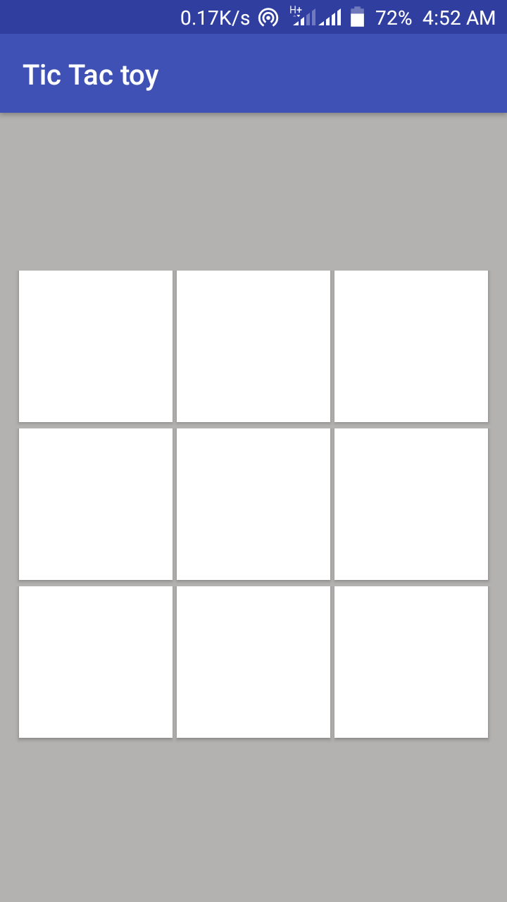
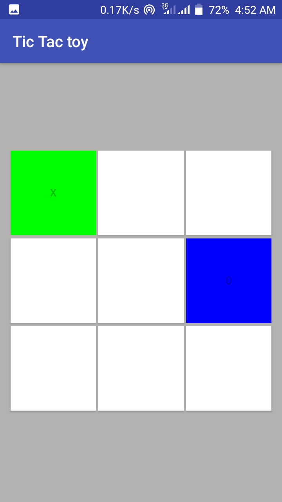
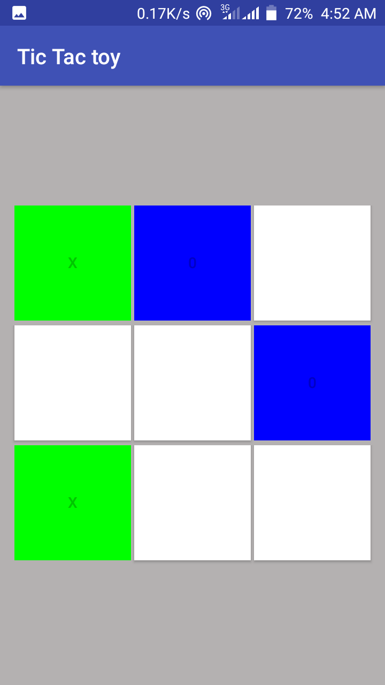
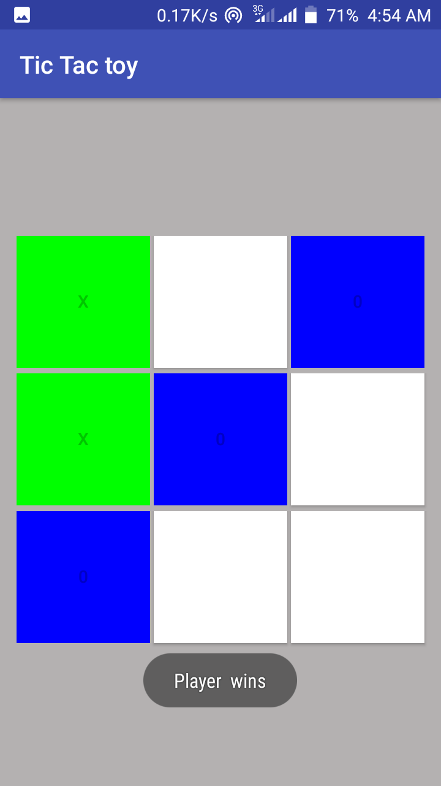

# TicTactoy Game App 

     
    
    
    

This is a [TicTactoy](https://en.wikipedia.org/wiki/Tic-tac-toe) gaming app.This 
was a beginner Kotlin class project. You can check it out if 
your interested in building gaming apps using kotlin from 
beginner level.
## Table of Contents
* [Features](#features)
* [Setup](#setup)
* [License](#license)
### Features
* Different colored buttons when pressed 
### Setup
* Install [Android studio](https://developer.android.com/studio)
* Install [Android Development Tools](https://docs.oracle.com/en/middleware/developer-tools/jet/tutorials/jetma/index.html)
#### Gradle
    gradle-4.4-all.zip
#### dependecies
    implementation"org.jetbrains.kotlin:kotlin-stdlib-jdk7:$kotlin_version"
    implementation 'com.android.support:appcompat-v7:27.1.1'
    implementation 'com.android.support.constraint:constraint-layout:1.1.3'
    
``TODO: Implement the rules``
### License
This project is licensed under [MIT license](./LICENSE) terms
